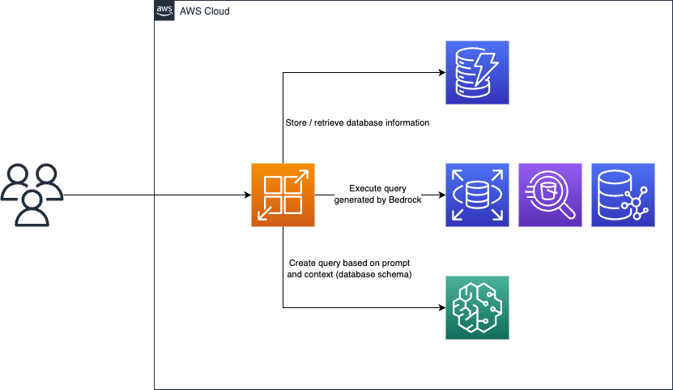

# Explore structured data with natural language using Amazon Bedrock

This is an application that translates natural language queries into data exploration queries for Amazon Neptune, Amazon RDS, and Amazon Athena. It leverages Amazon Bedrock for the translation process, allowing users to choose from a variety of Bedrock models -- including Claude v2 by Anthropic and Titan by AWS.

## Architecture Diagram



## Getting Started

To get started, you need to run the CloudFormation stack. This will set up the necessary AWS resources for the application.

### Pre-requisites

To set up this sample, you'll need:

- Installed [NodeJS v18+](https://nodejs.org/en/download)
- To be (AWS CLI) logged in to an AWS Account that's been allow-listed for the limited preview of Amazon Bedrock
- To be targeting a region (e.g. `export AWS_REGION=us-east-1`) where Bedrock is currently supported

I recommend using the provided CDK solution to automatically deploy and configure the solution including example data sources (RDS, Athena, Neptune) and sample dataset loading. To deploy the solution via AWS CDK (once you have the pre-requisites above):

- Open your terminal in the `cdk` subfolder
- `npm install` to install dependencies of the solution
- `npx cdk bootstrap` if you haven't already [bootstrapped](https://docs.aws.amazon.com/cdk/v2/guide/bootstrapping.html) your target AWS environment for CDK deployments
- `npx cdk deploy`
  - This will attempt to download the Bedrock preview SDK (so you must already be logged in to your target allow-listed AWS account) and compile the Java application locally (so you must have Java installed) before running the actual CDK synth/deployment.
- Check in CloudWatch ([as described here](https://catalog.us-east-1.prod.workshops.aws/workshops/2ae99bf2-10df-444f-a21f-8ad0537a9bdd/en-US/appendix)) that your Neptune data is fully copied (which may take some additional time after the main stack deployment is finished).

That should be it!

The CloudFormation stack creates a DynamoDB database with tables for Amazon Neptune, Amazon RDS, and Amazon Athena. These tables are used to store and manage the data for the application.

## Data Details

Here are the details of the data stored in the tables:

- **Amazon Neptune**: IMDb Graph - This table contains data about movies, their genres, and the artists that worked on them. The schema can be found [here](https://catalog.us-east-1.prod.workshops.aws/workshops/2ae99bf2-10df-444f-a21f-8ad0537a9bdd/en-US/workshop2/opencypher/model).

- **Amazon RDS**: Pagila DVD Rentals - This table represents a DVD rental store. It contains data about customers, rentals, and actors. The schema can be found [here](https://dev.mysql.com/doc/sakila/en/sakila-structure.html).

- **Amazon Athena**: TPC-H supply chain - This table is a supply-chain oriented business decision benchmarking dataset. It contains data about suppliers and part orders. The schema can be found [here](https://docs.snowflake.com/en/user-guide/sample-data-tpch).

After the stack is created, you need to set up the environment variables. You can find the required variables in the `.env.example` file. Copy the contents of this file into a new file named `.env` and replace the placeholders with your actual values.

```bash

cp .env.example  .env

nano .env

```

Here is a brief description of each environment variable:

- `AWS_ACCESS_KEY_ID`: Your AWS access key ID.

- `AWS_SECRET_ACCESS_KEY`: Your AWS secret access key.

- `AWS_SESSION_TOKEN`: Your AWS session token.

- `AWS_REGION`: The AWS region where your resources are located.

- `DYNAMODB_TABLE_NAME`: The name of your DynamoDB table.

Once the environment variables are set, you can start the application by running the development server:

```bash

npm run  dev

# or

yarn dev

# or

pnpm dev

```

Open [http://localhost:3000](http://localhost:3000) with your browser to see the result. You can start exploring data by entering a natural language query.

## Learn More

The main logic for query translation is located in `lib/user-query-execution.ts`. The API endpoint for executing queries is defined in `app/api/explore/route.ts`.

Your feedback and contributions are welcome!
